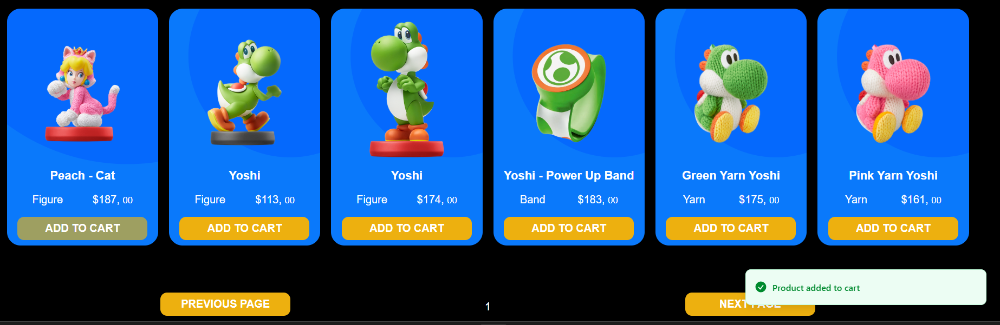
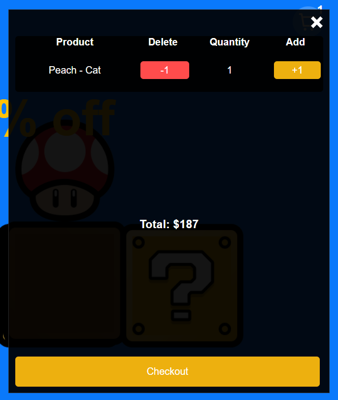
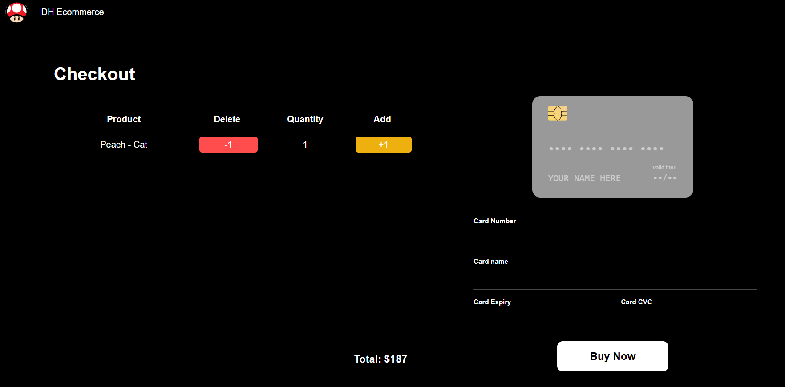
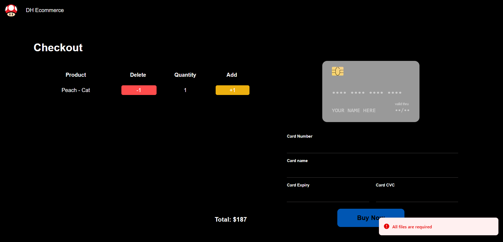
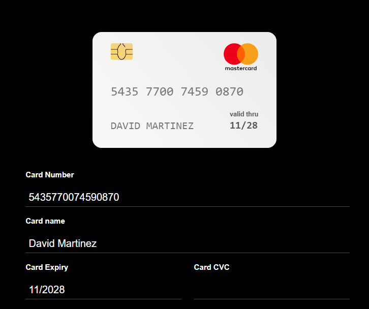
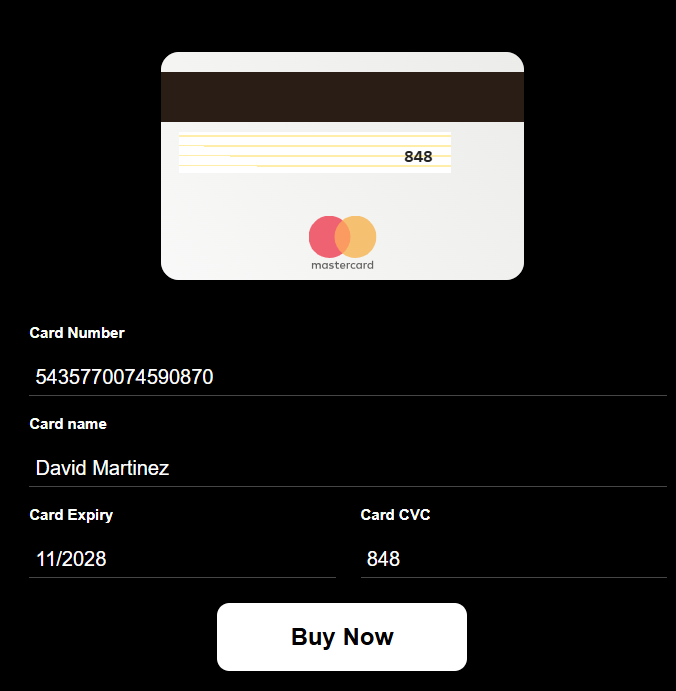
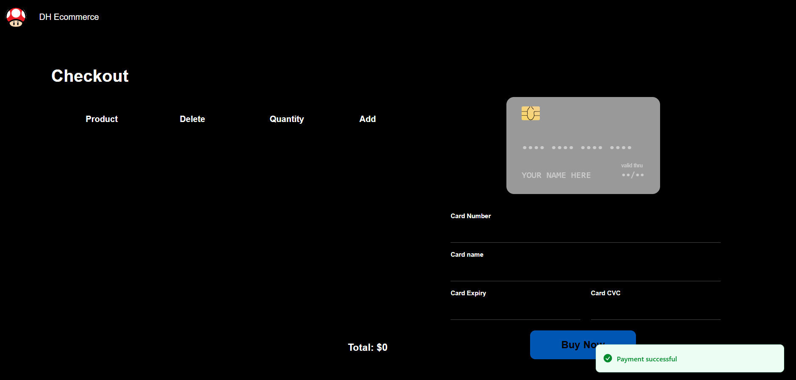

# 🛒 Amiibo Ecommerce

<div align="center">


**Aplicación ecommerce para la compra de figuras Amiibo de Nintendo**

[🌐 Ver Demo en vivo](https://dh-ecommerce.netlify.app/) · [📂 Ver código fuente](https://github.com/natanaelDominguez28/practica-ecommerce)

</div>

---

## 📋 Tabla de contenidos

- [Sobre el proyecto](#-sobre-el-proyecto)
- [Demo](#-demo)
- [Funcionalidades](#-funcionalidades)
- [Arquitectura y decisiones técnicas](#-arquitectura-y-decisiones-técnicas)
- [Tecnologías utilizadas](#-tecnologías-utilizadas)
- [Instalación y uso local](#-instalación-y-uso-local)
- [Estructura del proyecto](#-estructura-del-proyecto)
- [Autor](#-autor)

---

## 🎯 Sobre el proyecto

Proyecto integrador desarrollado durante el curso **React + Redux con TypeScript** dictado por Humberto Rivero para **Digital House**. La aplicación simula una tienda online de figuras coleccionables Amiibo de Nintendo, permitiendo al usuario explorar un catálogo, agregar productos al carrito y completar un proceso de compra con tarjeta de crédito.

---

## 🖥️ Demo

🔗 **[https://dh-ecommerce.netlify.app/](https://dh-ecommerce.netlify.app/)**

### Hero — Banner principal


### Catálogo de productos con paginación



### Carrito de compras


### Checkout — Formulario de pago



### Previsualización dinámica de tarjeta



### Pago exitoso


---

## ✨ Funcionalidades

### 🗂️ Catálogo de productos
- Listado de figuras Amiibo con imagen, nombre y precio

### 🛒 Carrito de compras
- Agregar y eliminar productos del carrito
- Visualización del total y cantidad de ítems
- Persistencia del estado del carrito durante la sesión

### 💳 Checkout
- Formulario de pago con previsualización dinámica de tarjeta de crédito (react-credit-cards-2)
- Validación de datos del formulario
- Notificaciones de feedback al usuario con Sonner (toasts)

### 📡 Consumo de datos
- Catálogo de más de 900 productos Amiibo servidos desde un archivo estático (`db.json`) en `public/`
- Paginación de 24 productos por página gestionada en el frontend
- Manejo de estados de carga y error con React Query

---

## 🏗️ Arquitectura y decisiones técnicas

### Gestión del carrito con Context API + useReducer
El estado del carrito se gestiona con el patrón **Context + useReducer**, una alternativa a Redux que combina la distribución global de estado de la Context API con la gestión predecible de acciones de un reducer. Se definieron tres acciones (`ADD_TO_CART`, `REMOVE_FROM_CART`, `CLEAR_CART`) con lógica de incremento/decremento de cantidad, y se expone el estado y el dispatch a través de un contexto dedicado accesible desde cualquier componente.

### Gestión del estado del servidor con React Query
Se optó por **React Query** para el fetching y caché de los datos del servidor en lugar de manejarlos manualmente con `useEffect` + `useState`. Esto simplifica el código al centralizar los estados de `loading`, `error` y `data`, y evita re-fetching innecesario gracias al sistema de caché.

### Enrutamiento con React Router DOM v7
La aplicación es una **SPA (Single Page Application)** con rutas declarativas usando la versión más reciente de React Router DOM. Cada sección de la app (catálogo, detalle de producto, carrito, checkout) tiene su propia ruta.

### Tipado estático con TypeScript
Todo el proyecto está tipado con **TypeScript**, lo que reduce errores en tiempo de desarrollo y mejora la autocompletación. Los modelos de datos (productos, items del carrito, etc.) están definidos como `interface` o `type`, garantizando consistencia en toda la aplicación.

### Datos estáticos con paginación en el frontend
El catálogo contiene más de 900 figuras Amiibo reales obtenidas de la [AmiiboAPI](https://amiiboapi.com/) y almacenadas en `public/db.json`. Al ser un archivo estático servido directamente por Vite/Netlify, no se necesita ningún servidor adicional. La paginación se resuelve en el frontend con `Array.slice()`, calculando el rango de productos correspondiente a cada página.

### Notificaciones con Sonner
Se utilizó **Sonner** como librería de toasts por su simplicidad de integración y su diseño moderno, sin necesidad de configurar un provider complejo.

---

## 🛠️ Tecnologías utilizadas

| Tecnología | Versión | Uso |
|---|---|---|
| React | 19 | Librería principal de UI |
| TypeScript | 5.9 | Tipado estático |
| React Router DOM | 7 | Navegación SPA |
| React Query | 3 | Fetching y caché de datos |
| React Credit Cards 2 | 1.0 | Previsualización de tarjeta |
| Sonner | 2 | Notificaciones / Toasts |
| Vite | 7 | Bundler y servidor de desarrollo |

---

## 🚀 Instalación y uso local

### Requisitos previos

- [Node.js](https://nodejs.org/) v18 o superior
- npm v9 o superior

### Pasos

**1. Clonar el repositorio**
```bash
git clone https://github.com/natanaelDominguez28/practica-ecommerce.git
cd practica-ecommerce
```

**2. Instalar dependencias**
```bash
npm install
```

**3. Iniciar la aplicación**
```bash
npm run dev
```

La app estará disponible en `http://localhost:5173`

### Scripts disponibles

| Comando | Descripción |
|---|---|
| `npm run dev` | Inicia el servidor de desarrollo |
| `npm run build` | Compila el proyecto para producción |
| `npm run preview` | Previsualiza el build de producción |
| `npm run lint` | Ejecuta el linter |

---

## 📁 Estructura del proyecto

```
practica-ecommerce/
├── public/                     # Archivos estáticos
│   └── db.json                 # Catálogo de productos Amiibo
├── src/
│   ├── assets/                 # Imágenes y recursos estáticos
│   ├── components/             # Componentes reutilizables de UI
│   ├── context/                # Contextos de React (estado global)
│   ├── hooks/                  # Custom hooks
│   ├── interface/              # Tipos e interfaces de TypeScript
│   ├── pages/                  # Vistas / páginas de la app
│   ├── service/                # Lógica de fetching y llamadas a datos
│   ├── App.css
│   ├── App.tsx
│   ├── index.css
│   └── main.tsx                # Punto de entrada
├── index.html
├── vite.config.ts
└── package.json
```

## 👤 Autor

**Natanael Dominguez**

- GitHub: [@natanaelDominguez28](https://github.com/natanaelDominguez28)
